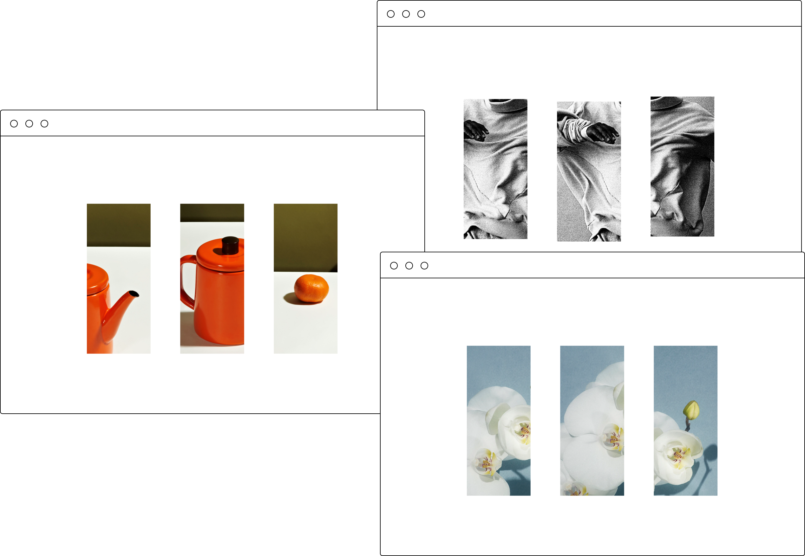

# are.na new tab Chrome extension

A Chrome plugin that uses imagery from an [are.na](https://www.are.na/) channel in a new tab.
 

## Features
* dark mode 🌝🌚
* persist channel name and dark mode between sessions
* based on [are.na API documentation](https://dev.are.na/documentation/channels)
* currently only supports public channels 📌

## Setup
`npm install` to run locally and `npm run watch` to watch. To build for loading into Chrome, `npm run build` and then load the `dist/` directory via "Load unpacked" on `chrome://extensions/`.
