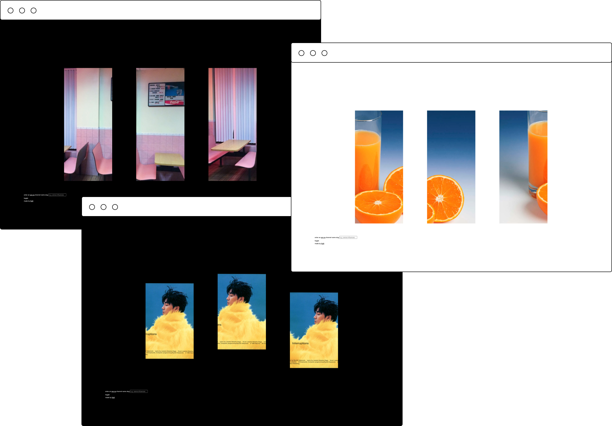

# are.na new tab Chrome extension

A Chrome plugin that uses imagery from an [are.na](https://www.are.na/) channel in a new tab.
 

## Features (beta)
* dark mode 🌝🌚
* ability to change channel - I suggest this one: https://www.are.na/tobias-koch/accidental-renaissance 
* persists channel name and dark mode between sessions
* based on [are.na API documentation](https://dev.are.na/documentation/channels)
* forked from [this repo](https://github.com/chibat/chrome-extension-typescript-starter)
* currently only supports public channels 📌

## Installation (beta)
* clone or download repo
* `npm install` to install dependencies
* `npm run build`
* load the `dist/` directory via "Load unpacked" on `chrome://extensions/` - don't forget you have to have "Developer mode: ON". You can also download a `zip` of the most recent build [here](https://www.dropbox.com/s/7km45gk6nngrvxm/dist.zip?dl=1).

## Run locally (beta)
You can `npm run watch` to watch changes.

## Feedback
I'm actively working on the code, and will aim to tidy things up considerably. Feel free to open an issue or a PR, or just email me.
